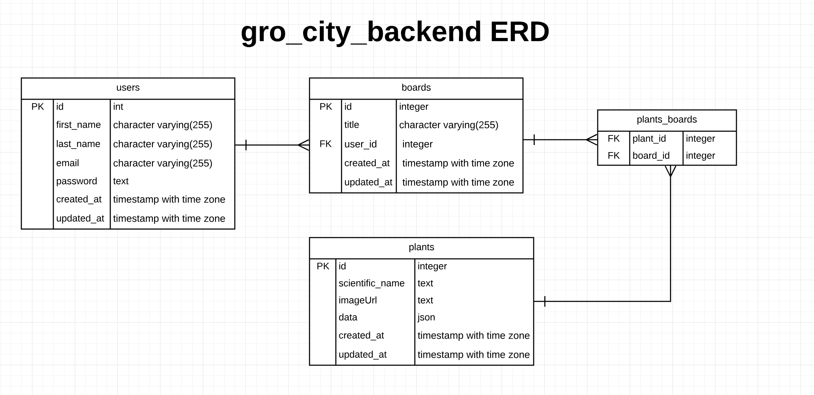
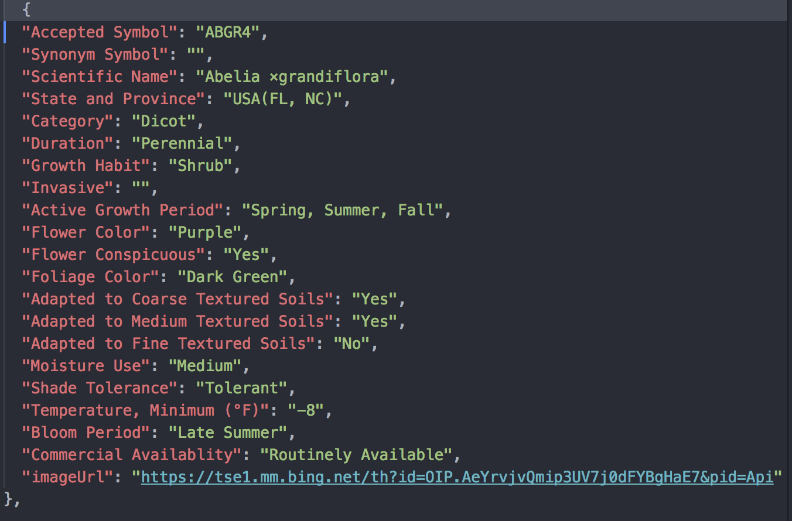

# gro-city-backend

## About
  - gro_city_backend is intended for accessing of plant data, board_data for gro_city users.

### Description
  - DB have 4 tables.
  - Here the users are allowed to signup and login
  - Create, Read, Update, Delete boards which keeps the information about plants in them.
  - Search for plants
  - Add plants to boards

### ERD

  

### Routes

  - Header
    - Authorization is sent as `Bearer` token
    - Content-Type: application/json

##### User routes

| Purpose | Request Type | Route | body | Authorization |
| --- | --- | --- | --- | --- |
| user signup | `post` | https://gro-city-backend.herokuapp.com/api/users/signup |  {first_name, last_name, email, password} | - |
| user login | `post` | https://gro-city-backend.herokuapp.com/api/users/login  | {email, password} | required |

##### Board routes

| Purpose | Request Type | Route | body | Authorization |
| --- | --- | --- | --- | --- |
| get all boards | `get` | https://gro-city-backend.herokuapp.com/api/boards/ | - | required |
| get one board | `get` | https://gro-city-backend.herokuapp.com/api/boards/:id | - | required |
| create one board | `post` | https://gro-city-backend.herokuapp.com/api/boards/ | {title} | required |
| update one board | `patch` | https://gro-city-backend.herokuapp.com/api/boards/:id | {title} | required |
| delete one board | `delete` | https://gro-city-backend.herokuapp.com/api/boards/:id | - | required |
| create one plant for a board | `delete` | https://gro-city-backend.herokuapp.com/api/boards/:id/plants/:plant_id | - | required |
| delete one plant from a board | `delete` | https://gro-city-backend.herokuapp.com/api/boards/:id/plants/:plant_id | - | required |

##### Plant routes

| Purpose | Request Type | Route | body | Authorization |
| --- | --- | --- | --- | --- |
| get all plants | `get` | https://gro-city-backend.herokuapp.com/api/plants/ | - | required |
| get all plants in a page | `get` | https://gro-city-backend.herokuapp.com/api/plants/:page | - | required |

## Plant data

  

## Installation

1. Fork and/or Clone this repository

1. `npm install`

1. `mv .env.sample .env`

1. `createdb gro_city_backend_dev && createdb gro_city_backend_test`
